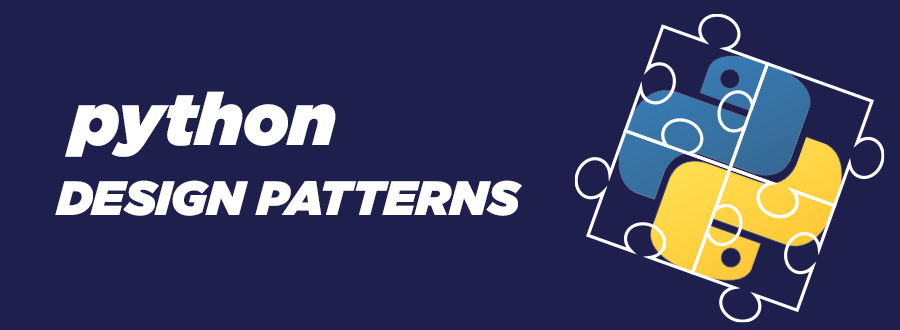

# Design Patterns Python


 

## Table of contents

* [General info](#General-info)
* [Attention](#Attention)
* [Technologies](#Technologies)
* [Design Pattern Map](#Design-Pattern-Map)
* [Help](#Help)
* [Setup](#Setup)

 

## General info

Hi , this is [Mr.Rezoo](https://www.linkedin.com/in/reza-mobaraki/) 

these are the most important design patterns

you can read and try design patterns with this code

 
#### Attention

Some pattern designs are implemented in several ways

 

## Technologies

Project is created with:

* Python: 3.6^
 

## Design Pattern Map 

This is a good cheat sheet to review and remind the design of important patterns


 

## Help

In this repository we work on 3 type on **design patterns**

* Creational => (Singleton , Factory , Abstract Factory , Prototype)
* Structural => (Adapter , Decorator , Proxy , Composite)
* Behavioral => (Observer , State , Strategy , Chain of responsibility , Template method)

The tree structure of these three pattern designs is as follows

```shell
DesignPattern git:(master) tree
```
```markdown
.
├── README.md
├── __pycache__
│   └── abstract_factory.cpython-39.pyc
├── abstract_factory.py
├── abstract_factory2.py
├── abstract_factory3.py
├── adapter.py
├── adapter2.py
├── builder.py
├── chain_of_responsibility.py
├── composit.py
├── decorator.py
├── decorator2.py
├── facade.py
├── factory.py
├── factory2.py
├── iterator.py
├── observer
│   ├── __init__.py
│   ├── __pycache__
│   │   ├── __init__.cpython-39.pyc
│   │   ├── decorator.cpython-39.pyc
│   │   ├── notification.cpython-39.pyc
│   │   └── shop.cpython-39.pyc
│   ├── decorator.py
│   ├── main.py
│   ├── notification.py
│   └── shop.py
├── observer2.py
├── prototype.py
├── prototype2.py
├── proxy.py
├── proxy2.py
├── proxy_dice.py
├── proxy_lazy.py
├── singleton.py
├── singleton2.py
├── state.py
├── state2.py
├── strategy.py
├── strategy3.py
├── strategy_2.py
└── template_method.py

3 directories, 40 files
```
 
## Setup

To run this project, install it locally using git-clone:

```shell
gh repo clone https://github.com/MrRezoo/design-patterns-python.git

#or
 
git clone https://github.com/MrRezoo/design-patterns-python.git
```


## License

Distributed under the MIT License. See [license](LICENSE.txt) for more information.
